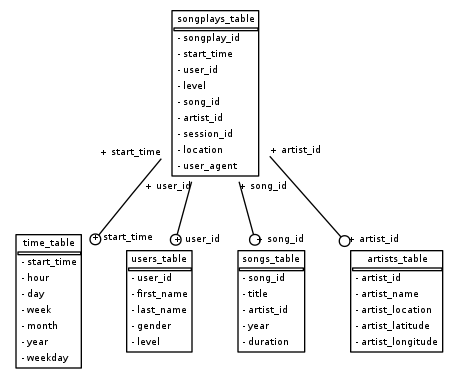

# **Data Modeling with Postgres**


## Introduction

A startup called Sparkify wants to analyze the data they've been collecting on songs and user activity on their new music streaming app. The analytics team is particularly interested in understanding what songs users are listening to. Currently, they don't have an easy way to query their data, which resides in a directory of JSON logs on user activity on the app, as well as a directory with JSON metadata on the songs in their app.

They'd like a data engineer to create a Postgres database with tables designed to optimize queries on song play analysis, and bring you on the project. Your role is to create a database schema and ETL pipeline for this analysis. You'll be able to test your database and ETL pipeline by running queries given to you by the analytics team from Sparkify and compare your results with their expected results.


## Project Description

In this project, you'll apply what you've learned on data modeling with Postgres and build an ETL pipeline using Python. To complete the project, you will need to define fact and dimension tables for a star schema for a particular analytic focus, and write an ETL pipeline that transfers data from files in two local directories into these tables in Postgres using Python and SQL.


## How To Execute This Project

Open terminal window on Jupyter Notebook and run commands:

1. ```python create_tables.py```
2. ```python etl.py```


## Database Schema

I created a Star schema (from `diagram_generator.py`) which include one Fact table (songplays_table) and 4 Dimension tables.



This design will offer flexibility with the queries being used for analysis.


## Project Dataset

1. Song Dataset (data folder)

The first dataset is a subset of real data from the Million Song Dataset. Each file is in JSON format and contains metadata about a song and the artist of that song. The files are partitioned by the first three letters of each song's track ID. For example, here are filepaths to two files in this dataset.

```
song_data/A/B/C/TRABCEI128F424C983.json
song_data/A/A/B/TRAABJL12903CDCF1A.json
```

2. Log Dataset (data folder)

The log files in the dataset are partitioned by year and month. For example, here are filepaths to two files in this dataset.

```
log_data/2018/11/2018-11-12-events.json
log_data/2018/11/2018-11-13-events.json
```

3. create_tables.py
A Python script create connection to sparkifydb, and prepare tables which will be use in the etl.py

3. etl.ipynb

A Python Jupyter Notebook that was used to initially explore the data and test the ETL process.

4. etl.py

A Python script reads in the Log and Song data files, processes and inserts data into the tables (created from create_tables.py) by queries from file sql_queries.py.

5. sql_queries.py

A Python script that defines all the SQL statements used by this project (be imported to etl.py and etl.ipynb).

6. test.ipynb

This file is used to check whether everything worked or not, including: schema, primary keys, data type, column names, data...